<h1>Camera Plugin</h1>

<h2>Introduction</h2>

The Camera feature plugin allows SDRangel to capture images and video from cameras and telescopes.
This is to support multimode observations, such as combing radio and optical observations of meteors or aircraft, but can also be used for observing remote radio equipment or conditions.

The Camera plugin supports images and video from:

* Qt6 Multimedia API (FFmpeg backend, which uses DirectShow on Windows, V4L2 on Linux and avfoundation on macOS)
* Qt5 Multimedia API (DirectShow on Windows, GStreamer/V4L2 on Linux)
* ASCOM Alpaca API supported by some telescopes (including support for Filter Wheels and Focusers)
* ASI cameras (ASICamera2 only currently included in Windows builds)
* Video files such as MP4, MOV, AVI (via FFmpeg)
* Streaming protocols such as http: rtsp: rtmp: (via FFmpeg)
* Image files such as PNG, JPEG and FITS.

The Camera plugin also supports a variety of post-processing, detection and overlay features, such as:

* Dark, flat and bias calibration frames
* Image stacking with alignment and quality rejection
* HDR stacking with multiple exposure brackets and merging algorithms
* Histogram stretching and colour adjustment
* YOLO AI object detection (CPU, OpenCV CUDA or TensorRT acceleration)
* Motion detection
* Star detection and plate solving
* Cloud detection
* Meteor apparent magnitude calculation, based on measaured flux relative to reference stars
* Difference detection between images
* ADS-B, AIS, satellite and star tracker item overlay
* Date/time and custom HTML overlay
* Spectrum overlay from SDRangel's SDR devices
* Azimuth/elevation and right ascension/declination sky grid overlays
* Generation of 24-hour keograms
* CUDA acceleration is supported for most operations and the processing runs in multiple threads.

Raw, calibrated, filtered or post-processed images can be saved as JPEG, PNG or FITS files, and video can be recorded in H264/H265 encoded MP4 files. Video can also be streamed to YouTube Live via RTMP.

The Camera feature can send events to the Scheduler feature when motion or YOLO object classes are detected, allowing you to automate actions such as recording from SDR devices, sending notifications or running custom commands. 
Recoding images and video can also be triggered via the Scheduler feature, allowing triggering based on time or RF events.

Camera position can be set manually or track GPS. Camera direction can be set manually or track a Rotator controller feature (for telescopes or mounted cameras)
or sensors such as a compass or accelerometer (for laptop webcams).

<h2>Interface</h2>


The Camera feature window contains two toolbars above the image display. Each toolbar control is described below.

<h3>1: Start/Stop capture</h3>

Starts or stops image capture from the selected camera.

<h3>2: Camera</h3>

Selects the camera source. A prefix followed by a colon indicates the underlying API used to access the camera:

* `qt:` Qt Multimedia camera source for most webcams. For Qt6 this uses the FFmpeg backend (which itself uses DirectShow on Windows, V4L2 on Linux and avfoundation on macOS), while for Qt5 it directly uses GStreamer/V4L2 on Linux.
* `alpaca:` ASCOM Alpaca camera source, for smart telescopes such as Seestar or Dwarf and many others.
* `asi`: ASI camera source, which uses the ASICamera2 library for ZWO ASI cameras.
* `video:` Video file source, which can read from MP4, MOV or AVI files.
* `images:` Image file source, which can read from PNG, JPEG or FITS files.
* `stream:` Streaming camera source, which can read from RTSP, RTMP or HTTP streams.

<h3>3: Refresh cameras</h3>

Refreshes the camera list.

<h3>4: Settings</h3>

Opens the Camera Settings dialog, which contains the camera capture and post-processing settings described later in this section.

<h3>5: Select video file, image files, or stream URL</h3>

Depending on the camera source, selects:

* `video:` a video file to play back, or
* `images:` a set of image files to display, or
* `stream:` a streaming URL to display.

<h3>6: Restart video</h3>

Restarts playback of the selected video file from the beginning.

<h3>7: Step back one frame</h3>

Steps the video file playback back one frame.

<h3>8: Step forward one frame</h3>

Steps the video file playback forward one frame.

<h3>9: Play/Pause video</h3>

Plays or pauses playback of the selected video file.

<h3>10: Loop video</h3>

When checked, video file playback loops back to the start when the end of the file is reached.
When unchecked, playback stops at the end of the file.

<h3>11: Playback rate</h3>

Sets the video file playback speed. 1.0 is normal speed.

<h3>12: Playback position</h3>

Seeks within the selected video file or image list. The label to the right of the slider shows the current playback position.

<h3>13: Audio mute</h3>

Left click mutes or unmutes audio from the camera or video source. Right click opens audio output device selection.

<h3>14: Zoom in</h3>

Zooms in on the image display.

<h3>15: Zoom out</h3>

Zooms out from the image display.

<h3>16: Fit image in view</h3>

Resizes the image view so the current image fits in the available display area.

<h3>17: Fit window to image</h3>

Resizes the camera feature window so the current image is displayed at 1:1 scale.

<h3>18: Save current image</h3>

Saves the currently displayed image to a JPEG or PNG file.

<h3>19: Save images</h3>

When checked, saves captured images using the image basename and record mode configured in the Recording tab in the Camera Settings dialog.

<h3>20: Record video</h3>

When checked, records video using the video basename and record mode configured in the Recording tab in the Camera Settings dialog.

<h3>21: Generate keogram</h3>

When checked, accumulates a keogram (a long-duration strip image built from one column or row per sample) using the Keogram settings in the Recording tab.

<h3>22: Stream to YouTube Live</h3>

When checked, streams the captured video to YouTube Live. The YouTube Live URL and stream key need to be set in the Recording tab in the Camera Settings dialog.

<h3>23: Image stacking</h3>

Enables image stacking using the stacking settings in the Cal / Stack tab in the Camera Settings dialog.

<h3>24: Invert colours</h3>

Inverts the displayed image colours.

<h3>25: Histogram</h3>

Opens the histogram window for the current image.

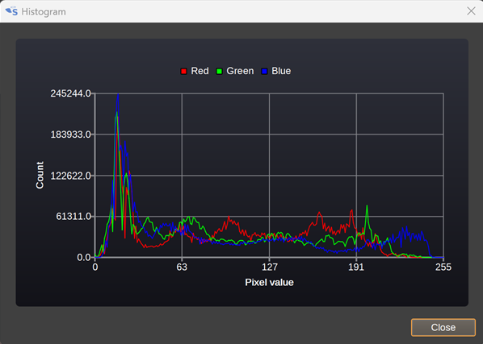

The histogram shows a count of the number of pixels with a given value, for red, green and blue.

<h3>26: Object detection</h3>

Check to enable object detection. This uses an AI model to detect objects such as people or cars within an image, drawing a bounding box around them.

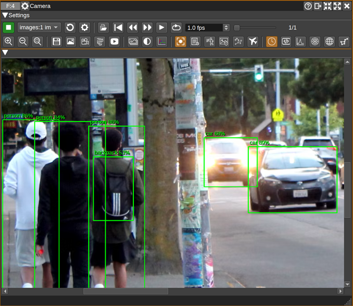

The classes of objects that can be detected depend upon the dataset the AI model has been trained on.
You can use your own YOLO ONNX models or one of several predefined models that can be downloaded.
The YOLO ONNX model to use must be set in the Object Detection sub-tab in the Camera Settings dialog.

When an object is detected an event will be emitted that can be used by the Scheduler feature to perform user-defined actions.

<h3>27: Object detection history</h3>

Opens the object detection history dialog.

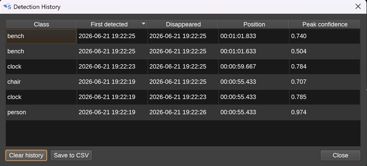

The detection history dialog has a table that records the date and time when object detections of each class were first detected and when they disappeared.
If the source is `video:` or `images:`, the position column will indicate the time within that file. Double clicking a row will seek the video to that time.

Pressing 'Clear history' will clear the detection history.
Pressing 'Save to CSV' will show a file dialog to select a filename to save the detection history to in CSV format.

<h3>28: Motion detection</h3>

Check to enable motion detection, which highlights parts of the image that are moving by drawing a bounding box around them. This can be used to detect aircraft, satellites, meteors, wildlife or people, without needing an AI model.

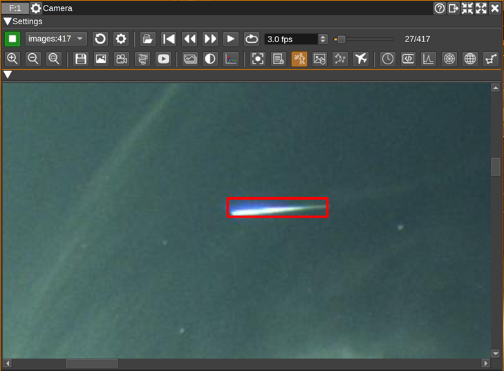

Motion detection works by building up a statistical model of the static background of the scene from recent frames. Each new frame is compared against this background model, and pixels that differ significantly are classified as foreground (moving). The foreground pixels are grouped together into bounding boxes that are drawn on the image. Because the background is continually relearned, slow changes such as the sun moving across the sky or gradual changes in lighting are absorbed into the background and do not trigger detection, while faster moving objects do.

As the background model is learnt over time, motion detection is generally not reliable for the first few seconds of capture, until the model has stabilised. Detection also restarts whenever capture is started or the motion settings are changed.

How sensitive the detection is, and how it deals with noise and small or brief movements, is controlled by the settings on the Motion Detection sub-tab in the Camera Settings dialog. In particular:

When motion is detected, an event is emitted that can be used by the Scheduler feature to perform user-defined actions, such as starting a recording or running a command. A second event is emitted when the motion stops.

<h3>29: Difference mask</h3>

Enables display of differences from previous images using the Difference Detection settings.
There are settings to control how large the difference must be and how many differences there should be in a region for it to be visible, and how much to dilate the region so nearby similar pixels are also visible.

In this image, difference detection shows a satellite flare, while hiding background stars:

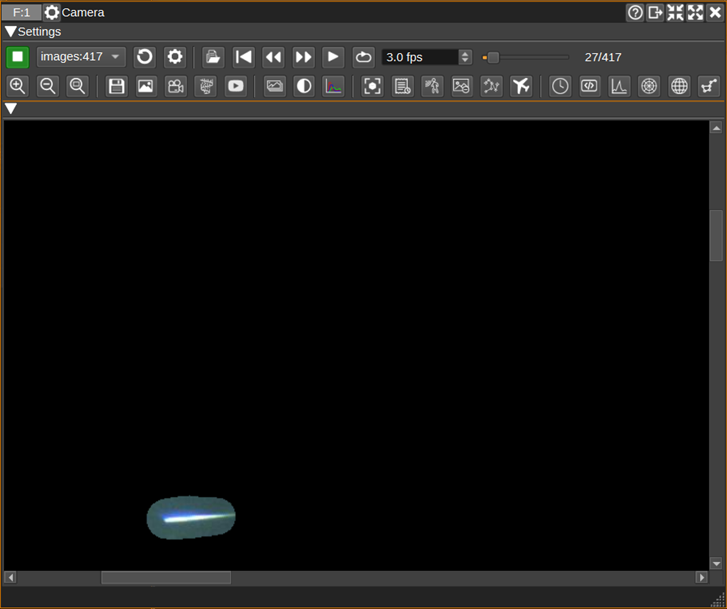

<h3>30: Star detection and plate solving</h3>

Enables star detection and plate solving.
This can be used to display labels showing the names of stars detected within an image, or to work out the direction a camera is pointing.
Plate solving can be used for both narrow field-of-view telescopes:

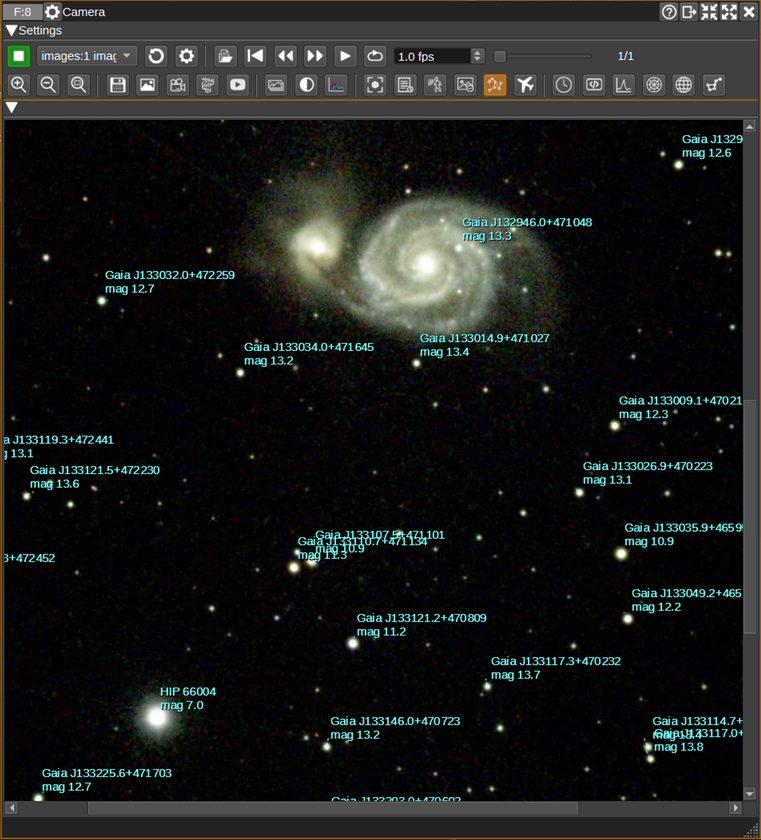

and wide-angle all-sky cameras:

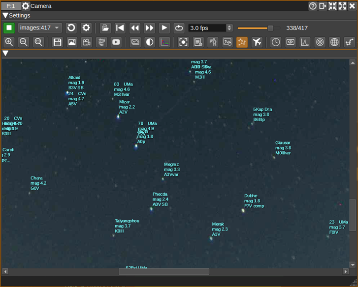

The solution gives the direction the camera is pointing, field-of-view and lens distortion parameters:

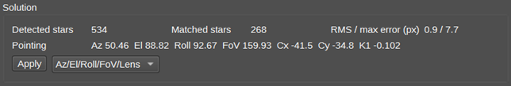

<h3>30a: Cloud detection</h3>

Check to enable cloud detection, which classifies each part of the sky as cloud or clear and reports the overall cloud coverage percentage. The resulting cloud mask can optionally be used by the other detectors:

* The star detector can drop detections that fall inside the cloud mask, so cloud structure breaking up into star-like blobs does not produce false stars or mislead the plate solver.
* The motion detector can suppress bounding boxes that substantially overlap the cloud mask, so drifting clouds do not register as motion while aircraft, meteors or satellites in clear sky are still caught.

Two classification paths are used, selected manually or automatically. Automatic selection uses the sun elevation computed from the camera position and the frame's observation time - the wall clock for live cameras, or the capture time derived from the file name for video and image playback (with the plate-solve date/time settings as a manual override for recorded media without one). The day path is used only when the sun is up or in early twilight; the rest of the twilight range and full night use the night path, because a high-gain camera makes twilight brightness an unreliable day/night cue and the night path's moonlit branch already handles bright twilight cloud. When no observation time is available, overall frame brightness decides instead.

* At night, two regimes are handled. On dark nights, cloud lit by ground light or the moon is locally brighter than the sky around it, while the sky itself only varies smoothly (horizon glow, light pollution, vignetting): a smooth surface is fitted to the sky and the local sky level is compared against it, so the smooth gradient is absorbed by the fit and only localized cloud (which stands out above the surface) is classified. On bright nights (moonlit, or shot with high gain and long exposure - chosen when at least a quarter of the evaluated sky is bright, so a half-overcast moonlit sky counts) the sky behaves like dim daylight - clear sky is blue, cloud is white or pink - so cloud is classified by the red/blue ratio, with the threshold anchored to the bluest part of the bright sky since gain and night white balance shift the whole colour scale (but never above the day threshold, so a fully overcast sky - where there is no clear sky to anchor to - is still detected). Regions much brighter than the median night sky are also classified as cloud, which catches moonlit cloud sheets when cloud covers most of the frame and there is little clear sky to calibrate the colour threshold against. Finally, a structure vote catches pale bluish-white overcast that colour cannot: such cloud is spectrally identical to clear blue sky, but it is lumpy where clear sky is smooth, so band-pass local-contrast detections (gated to bright pixels away from the dark frame surround, whose glow rim mimics them) are tallied over each unflagged area - lumpy neighbourhoods and uniformly lumpy connected regions are reclassified as cloud, while genuinely clear sky, whose detection density is an order of magnitude lower, is left alone.
* By day, cloud is white or grey against blue sky, so a per-pixel red/blue ratio is thresholded. Grey or white but finely textured regions - roofs, trees, buildings - would pass the ratio test, so they are rejected by an additional texture veto: cloud is smooth at the detection resolution, while man-made surfaces and foliage retain dense fine detail. Dark neutral regions - lens vignette, shadowed structures - are rejected by a brightness floor anchored to the evaluated sky's median brightness, since daytime cloud is at least comparably bright to the sky.

Clouds evolve slowly, so the mask is only recomputed every few frames (configurable) and intermediate frames reuse the previous mask.

When output scaling places the image inside a larger canvas, the padded borders are excluded automatically: they are never classified as cloud, do not count towards the coverage percentage, and do not influence the automatic day/night decision.

When OpenCV CUDA support is available and enabled, the full-resolution part of cloud detection (crop, downscale, luminance extraction and median filtering) runs on the GPU, so GPU-resident frames from earlier pipeline stages do not need to be downloaded at full resolution.

Cloud-classified regions can be tinted on the image with a configurable colour, and the coverage percentage is shown on the Cloud Detection sub-tab in the Camera Settings dialog and reported via the API.

When the coverage percentage rises to the configured event threshold, a Camera Cloud Coverage High event is emitted that can be used by the Scheduler feature to perform user-defined actions, such as pausing recordings or sending notifications. A Camera Cloud Coverage Low event is emitted when coverage falls back 10 points below the threshold (the gap prevents coverage hovering around the threshold from repeatedly triggering). When capture starts, an event describing the initial sky state is emitted, so automation immediately knows whether the sky is clear or overcast. These events are emitted by the feature itself, so they also work in server mode.

<h3>31: Item overlay</h3>

Overlays ADS-B, AIS, satellite, star tracker and other items sent to the Map feature on the camera image. Options can show recent tracks, a heat map, and the line-of-sight range to each item in km.


For this to work, the position and direction of the camera must be set in the Camera Settings dialog.

<h3>32: Date/time overlay</h3>

Overlays the configured date and time string on the image.

<h3>33: HTML overlay</h3>

Overlays the configured HTML on the image.


The following variables can be used in the HTML. Values are HTML-escaped before being substituted:

* `${date}`: Capture date in ISO format.
* `${time}`: Capture time in `HH:mm:ss` format.
* `${exposure}`: Exposure time in milliseconds.
* `${cameraId}`: Camera source identifier.
* `${latitude}`: Camera latitude in degrees.
* `${longitude}`: Camera longitude in degrees.
* `${altitude}`: Camera altitude in metres.
* `${azimuth}`: Camera azimuth in degrees.
* `${elevation}`: Camera elevation in degrees.
* `${roll}`: Camera roll in degrees.
* `${temp}`: Weather temperature, or `N/A` if unavailable.
* `${pressure}`: Weather pressure, or `N/A` if unavailable.
* `${humidity}`: Weather humidity, or `N/A` if unavailable.
* `${cloudCoverPercent}`: Cloud coverage percentage from the cloud detector, or `N/A` if unavailable.
* `${cloudiness}`: Weather cloudiness, or `N/A` if unavailable.
* `${windSpeed}`: Weather wind speed, or `N/A` if unavailable.
* `${windDirection}`: Weather wind direction, or `N/A` if unavailable.

<h3>34: Spectrum overlay</h3>

Overlays a spectrum view from a selected SDRangel device set on the image.


<h3>35: Azimuthal grid overlay</h3>

Overlays the azimuth/elevation sky grid.


<h3>36: Equatorial grid overlay</h3>

Overlays the right ascension/declination equatorial sky grid.

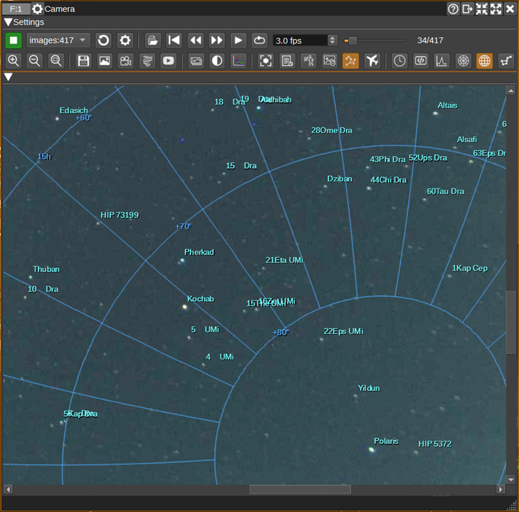

<h3>37: Constellation overlay</h3>

Overlays the selected constellation stars. This can be used to help determine the camera's pose.

<h3>38: Image display</h3>

Displays the captured image, including enabled post-processing, detection results and overlays.

<h2>Camera Settings dialog</h2>

Press the Settings button (4) to open the Camera Settings dialog. The dialog contains the tabs described below. Each setting is given a numbered heading. The Close button at the bottom of the dialog closes it.

<h3>Camera tab</h3>

The Camera tab contains the capture settings for the selected camera. The settings displayed will vary according to the camera and which capabilities it reports.

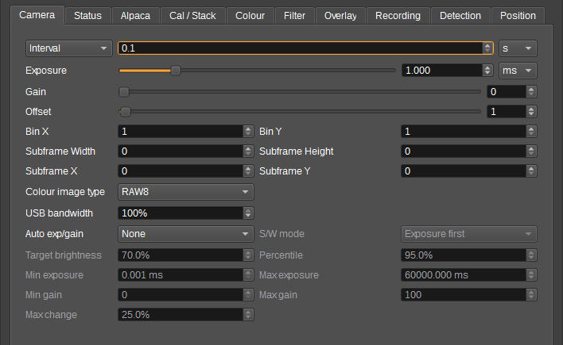

<h4>1. Resolution</h4>

Selects the camera capture size in pixels.

<h4>2. Frame rate / Interval mode</h4>

Selects whether the camera captures continuous video frames or still images at a timed interval.

<h4>3. Frame rate</h4>

Selects a supported frame rate from a list, or enters a frame rate in frames per second directly when the camera exposes a numeric control.

<h4>4. Interval</h4>

When in interval mode, sets the time between still-image captures. The adjacent units combo selects seconds or minutes.

<h4>5. Exposure</h4>

Sets the camera exposure time using the slider and spin box. The adjacent units combo selects the exposure time units.

<h4>6. ISO</h4>

Sets the camera ISO value. -1 selects automatic ISO when supported.

<h4>7. Exp. comp. (EV)</h4>

Sets exposure compensation in EV steps, from -2.0 to +2.0.

<h4>8. White balance</h4>

Selects the camera white balance mode.

<h4>9. Zoom</h4>

Sets the hardware optical zoom factor.

<h4>10. Focus mode</h4>

Selects the camera focus mode.

<h4>11. Focus distance</h4>

Sets the normalised manual focus distance, where 0.0 is near and 1.0 is far or infinity.

<h4>12. Gain</h4>

Sets the camera gain using the mode combo, slider and spin box, when supported by the selected device.

<h4>13. Offset</h4>

Sets the camera offset using the mode combo, slider and spin box, when supported by the selected device.

<h4>14. Bin X / Bin Y</h4>

Set the sensor binning in the X and Y directions for Alpaca cameras.

<h4>15. Subframe Width / Subframe Height</h4>

Set the captured subframe size after binning. A value of 0 uses the full available image in that dimension.

<h4>16. Subframe X / Subframe Y</h4>

Set the subframe offset after binning.

<h4>17. Readout mode</h4>

Selects the Alpaca camera sensor readout mode.

<h4>18. Colour image type</h4>

Selects RGB24 camera-side colour conversion, RAW16 16-bit Bayer data or RAW8 8-bit Bayer data debayered in SDRangel, for ASI cameras.

<h4>19. Cooler</h4>

Enables or disables the ASI camera cooler.

<h4>20. Target temp</h4>

Sets the ASI cooler target temperature.

<h4>21. USB bandwidth</h4>

Sets the ASI USB bandwidth limit as a percentage.

<h4>22. High speed mode</h4>

Enables the ASI high speed transfer mode.

<h4>23. Auto exp/gain</h4>

Selects no auto exposure/gain, software control, or camera hardware control where available. The adjacent S/W mode combo chooses whether software auto exposure adjusts exposure or gain first.

<h4>24. Target brightness / Percentile</h4>

Target brightness sets the brightness target for the measured percentile, and Percentile sets the brightness percentile used for the software auto-exposure measurement.

<h4>25. Min exposure / Max exposure</h4>

Set the minimum and maximum exposure time used by software auto-exposure.

<h4>26. Min gain / Max gain</h4>

Set the minimum and maximum gain used by software auto-exposure.

<h4>27. Max change</h4>

Sets the maximum exposure or gain change applied after each measured frame.

<h4>28. Focus position</h4>

Sets the Alpaca focuser position.

<h4>29. Focus step size</h4>

Sets the increment used when changing the Alpaca focuser position.

<h4>30. Auto focus</h4>

The Start button runs a software autofocus sweep using image sharpness. Capture must be running. The adjacent label shows the autofocus status.

<h4>31. Filter</h4>

Selects the Alpaca filter wheel position by name.

<h3>Status tab</h3>

The Status tab displays read-only information about the current camera and processing pipeline, and a chart of camera sensor temperature.

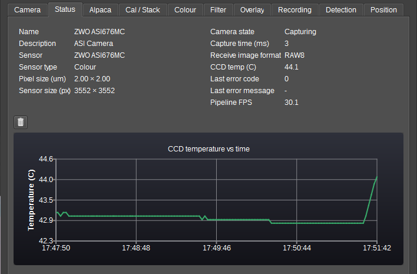

<h4>1. Name / Description</h4>

Identify the selected camera.

<h4>2. Sensor / Sensor type</h4>

Describe the camera sensor when reported by the device.

<h4>3. Pixel size / Sensor size</h4>

Show the sensor pixel size in microns and the image dimensions in pixels.

<h4>4. Camera state</h4>

Shows the current Alpaca camera capture state.

<h4>5. Capture time</h4>

Shows the last capture time in milliseconds.

<h4>6. Receive image format</h4>

Shows the format of the most recently received image.

<h4>7. CCD temp</h4>

Shows the reported camera sensor temperature in degrees Celsius.

<h4>8. Last error code / Last error message</h4>

Show the last Alpaca API error code and message.

<h4>9. Pipeline FPS</h4>

Shows the measured image-processing frame rate.

<h4>10. Clear chart</h4>

Clears the camera temperature chart.

<h3>Alpaca tab</h3>

The Alpaca tab configures ASCOM Alpaca discovery, API access and auxiliary devices.

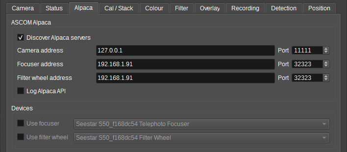

<h4>1. Discover Alpaca servers</h4>

When checked, discovers Alpaca servers on the local network and populates the camera list from the responses, instead of using only the configured host and port.

<h4>2. Camera address</h4>

Sets the IP address / hostname and port of the ASCOM Remote Server for the camera.

<h4>3. Focuser address</h4>

Sets the IP address / hostname and port of the Alpaca focuser server.

<h4>4. Filter wheel address</h4>

Sets the IP address / hostname and port of the Alpaca filter wheel server.

<h4>5. Log Alpaca API</h4>

When checked, logs Alpaca API requests and responses using qDebug.

<h4>6. Use focuser</h4>

Enables an Alpaca focuser, and the adjacent combo selects one of the discovered focusers.

<h4>7. Use filter wheel</h4>

Enables an Alpaca filter wheel, and the adjacent combo selects one of the discovered filter wheels.

<h3>Cal / Stack tab</h3>

The Cal / Stack tab configures calibration frames and image stacking.

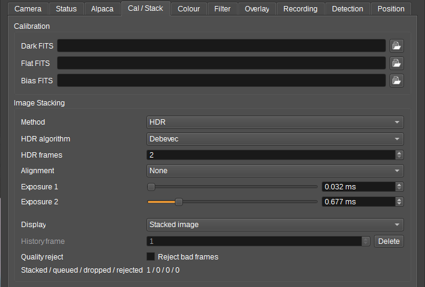

<h4>1. Dark FITS / Flat FITS / Bias FITS</h4>

Set the optional FITS master dark, flat and bias frames used for pre-stacking calibration. The browse button next to each field selects the corresponding FITS file.

<h4>2. Method</h4>

Selects the stacking method used to combine frames: Average, Median, Sigma clipped average, Lucky sharp average or HDR.

<h4>3. HDR algorithm</h4>

Selects the algorithm used to merge bracketed HDR frames: Debevec, Robertson or Mertens.

<h4>4. Frames</h4>

Sets how many frames are combined into one stacked output image.

<h4>5. HDR frames</h4>

Selects how many exposure buckets (2 to 4) are used for HDR stacking.

<h4>6. Alignment</h4>

Selects optional frame alignment before stacking: None, Phase correlation (translation only) or Star centroid matching (which can also compensate for small rotation/scale drift).

<h4>7. Exposure 1 to Exposure 4</h4>

The HDR exposure sliders and spin boxes set the exposure values in milliseconds used by HDR stacking.

<h4>8. Display</h4>

Selects what is displayed: the stacked image output, one stored stack history frame, or a tiled overview of stored frames.

<h4>9. History frame</h4>

Selects the stack history frame to display or delete. The Delete button removes the selected stack history frame.

<h4>10. Quality reject</h4>

When Reject bad frames is checked, obvious bad stack frames are rejected using brightness, saturation, contrast and sharpness checks.

<h4>11. Stacked / queued / dropped / rejected</h4>

Displays counts of frames that have been stacked, queued, dropped and rejected in the current stack.

<h3>Colour tab</h3>

The Colour tab controls image colour adjustment and histogram stretching.

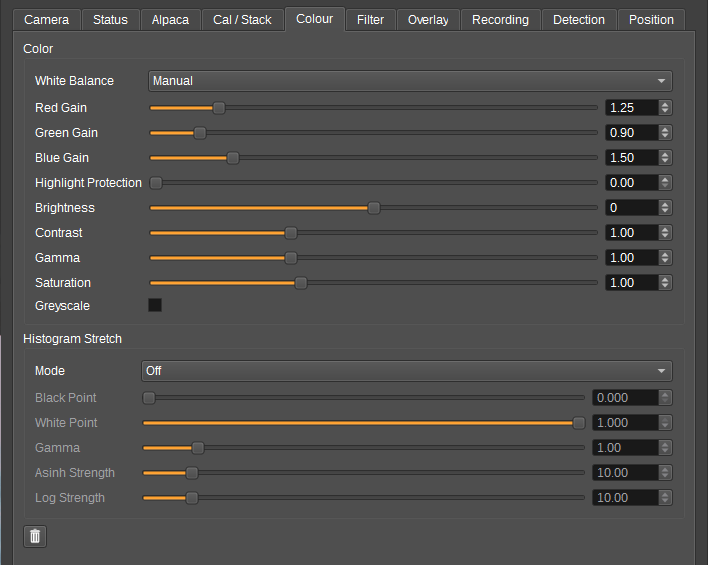

<h4>1. White Balance</h4>

Selects Off, Auto or Manual post-processing white balance.

<h4>2. Red Gain / Green Gain / Blue Gain</h4>

Sliders and spin boxes that set the manual white-balance gains.

<h4>3. Highlight Protection</h4>

Reduces manual white-balance gain in saturated highlights to keep bright white areas neutral.

<h4>4. Brightness / Contrast / Saturation / Gamma</h4>

Sliders and spin boxes that adjust image tone and colour.

<h4>5. Greyscale</h4>

Converts the image to greyscale after white balance.

<h4>6. Histogram Stretch Mode</h4>

Selects Off, Linear, Gamma, Asinh, Log or CLAHE stretching.

<h4>7. Black Point / White Point</h4>

Set the stretch input range.

<h4>8. Gamma / Asinh Strength / Log Strength</h4>

Set the parameters for the Gamma, Asinh and Log stretch modes respectively.

<h4>9. Reset color settings</h4>

Restores the colour and histogram stretch controls to their default values.

<h3>Filter tab</h3>

The Filter tab controls image filtering and geometric transformation.

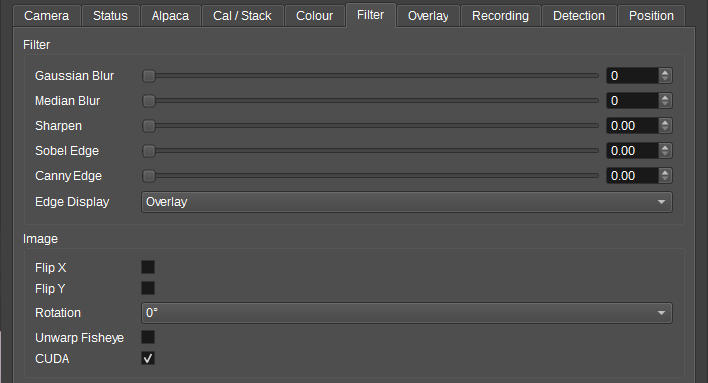

<h4>1. Gaussian Blur / Median Blur</h4>

Sliders and spin boxes that set the blur strength. 0 disables the blur.

<h4>2. Sharpen</h4>

Sets the image sharpening amount.

<h4>3. Sobel Edge / Canny Edge</h4>

Set the Sobel and Canny edge detection blend amounts.

<h4>4. Edge Display</h4>

Selects whether detected edges are overlaid on the image or shown as edges only.

<h4>5. Flip X / Flip Y</h4>

Mirror the image horizontally or vertically.

<h4>6. Rotation</h4>

Rotates the image clockwise by 0, 90, 180 or 270 degrees.

<h4>7. Unwarp Fisheye</h4>

Unwarps the image from the configured fisheye lens projection using the camera FoV setting in the Position tab.

<h4>8. CUDA</h4>

When checked, uses OpenCV CUDA functions for supported camera processing steps.

<h3>Overlay tab</h3>

The Overlay tab controls the spectrum, sky grid, tracked-object, date/time and HTML text overlays.

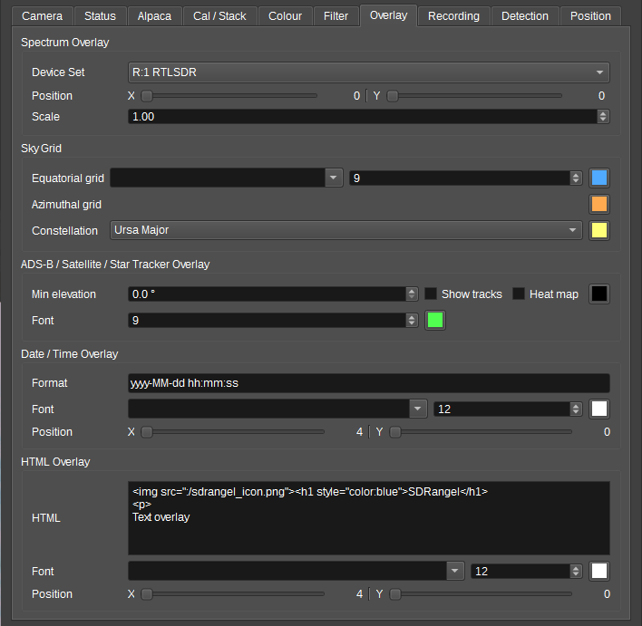

<h4>1. Spectrum Device Set</h4>

Selects the device set whose spectrum view is overlaid.

<h4>2. Spectrum Position</h4>

The X and Y sliders set the spectrum overlay offset in pixels, with readouts showing the current values.

<h4>3. Spectrum Scale</h4>

Sets the spectrum overlay scale factor.

<h4>4. Equatorial grid / Azimuthal grid</h4>

The colour buttons select the colours used for the right ascension/declination and azimuth/elevation grids. The grids are enabled from the main toolbar.

<h4>5. Grid label font</h4>

The font combo and font scale spin box set the font and point size used for sky grid labels.

<h4>6. Constellation</h4>

Selects which constellation major stars to overlay (Ursa Major, Orion or Crux), and the colour button selects the constellation overlay colour.

<h4>7. Min elevation</h4>

Sets the lowest elevation in degrees for tracked-object overlays.

<h4>8. Track object font / colour</h4>

The font scale spin box and colour button set the tracked-object label point size and colour.

<h4>9. Show tracks / Heat map</h4>

Show tracks displays the recent track for each tracked overlay object, and Heat map shows a heat map built from recent tracked object positions. The adjacent button clears the heat map.

<h4>10. Date/time Format</h4>

Sets the `QDateTime` format string (e.g. `yyyy-MM-dd hh:mm:ss`) used by the date/time overlay. The UTC button displays the overlay timestamp in UTC rather than local time.

<h4>11. Date/time Font / colour</h4>

The font combo, font scale spin box and colour button set the date/time text appearance.

<h4>12. Date/time Position</h4>

The X and Y sliders set the date/time overlay position in pixels, with readouts showing the current values. A Y value of 0 auto-positions the text at the bottom.

<h4>13. HTML</h4>

Sets the HTML text to render on the image. Use `src=file:///path/to/images/logo.png` for img tags; http is not supported.

<h4>14. Text Font / colour</h4>

The font combo, font scale spin box and colour button set the HTML text appearance.

<h4>15. Text Position</h4>

The X and Y sliders set the HTML text overlay position in pixels, with readouts showing the current values. A Y value of 0 auto-positions the text at the bottom.

<h3>Recording tab</h3>

The Recording tab configures image and video file output, video file playback, keograms and YouTube Live streaming.

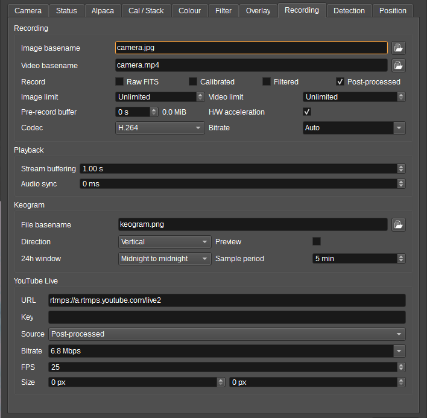

<h4>1. Image basename</h4>

Sets the file basename used when saving images. The browse button selects the basename using a file dialog.

<h4>2. Video basename</h4>

Sets the file basename used when recording video. The browse button selects the basename using a file dialog.

<h4>3. Record</h4>

Selects which outputs are recorded: Raw FITS (uncalibrated Bayer still images), Calibrated (calibrated/debayered media without overlays), Filtered (filtered media after image processing, before overlays) and Post-processed (media with overlays).

<h4>4. Image limit</h4>

Number of image frames to save before image recording is automatically disabled; 0 (Unlimited) records until disabled manually.

<h4>5. Video limit</h4>

Seconds of video to record before video recording is automatically disabled; 0 (Unlimited) records until disabled manually.

<h4>6. Pre-record buffer</h4>

Seconds of live video frames to keep before recording starts, so that recordings include lead-in footage. The adjacent label shows the estimated memory used.

<h4>7. H/W acceleration</h4>

When checked, prefers hardware-accelerated video encoding when supported by the backend.

<h4>8. Codec</h4>

Selects the codec used for saved video recordings: H.264 or H.265.

<h4>9. Bitrate</h4>

Sets the saved video bitrate. Select Auto to choose from frame size and rate, select a preset, or enter a custom value such as 8000 Kbps or 8 Mbps.

<h4>10. Stream buffering</h4>

Sets the amount of decoded media buffered for stream: sources before playback starts or resumes after a stall.

<h4>11. Audio sync</h4>

Adjusts audio timing for video file playback, in milliseconds. A negative value delays the video, a positive value delays the audio.

<h4>12. Keogram File basename</h4>

Sets the file basename used for saved keograms (.jpg or .png). The browse button selects the basename using a file dialog.

<h4>13. Keogram Direction</h4>

Selects whether the keogram is built Horizontally or Vertically. The Preview check box shows a live keogram preview window.

<h4>14. Keogram 24h window</h4>

Selects the 24-hour window, Midnight to midnight or Midday to midday. The Sample period spin box sets the number of minutes between keogram samples.

<h4>15. YouTube URL / Key</h4>

Set the YouTube RTMP or RTMPS ingest URL and the stream key used for YouTube Live streaming.

<h4>16. YouTube Source</h4>

Selects whether YouTube receives Calibrated frames or Post-processed frames including overlays.

<h4>17. YouTube Bitrate / FPS / Size</h4>

Set the YouTube stream video bitrate (preset or custom value), the stream frame rate, and the output width and height in pixels (0 uses the source size).

<h3>Detection tab</h3>

The Detection tab contains a common ROI sub-tab and sub-tabs for object, motion, cloud, star and difference detection. The Reset Defaults button at the bottom of the tab restores all detection settings to their defaults.

On the ROI sub-tab:

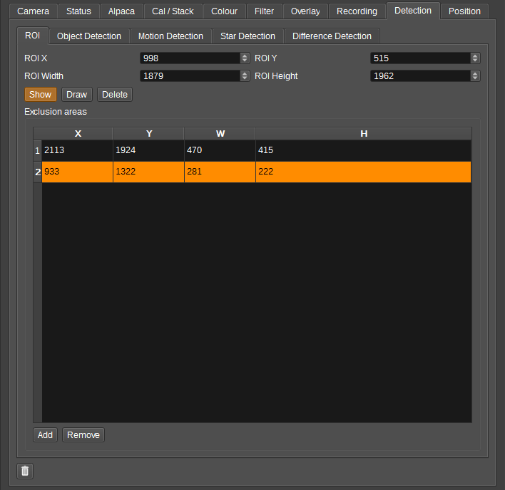

<h4>1. ROI X / ROI Y / ROI Width / ROI Height</h4>

Define the sub-region used for object detection, motion detection and image differencing. A width or height of 0 uses the full image in that dimension.

<h4>2. Show</h4>

Overlays the detection ROI on the preview image.

<h4>3. Draw</h4>

Lets you draw the detection ROI on the preview image.

<h4>4. Delete</h4>

Deletes the detection ROI and resets its bounds to 0.

<h4>5. Exclusion areas</h4>

The exclusion area table lists the full-resolution exclusion rectangles used for detection. The Add and Remove buttons add and remove exclusion rectangles.

On the Object Detection sub-tab:

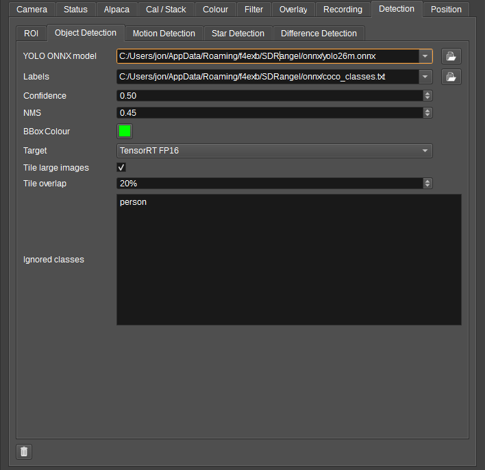

<h4>1. YOLO ONNX model</h4>

Selects the object detection model from the list of preset URLs or an entered path. The browse button selects a local model file.

<h4>2. Labels</h4>

Selects the class labels file (one name per line). The browse button selects a local labels file.

<h4>3. Confidence</h4>

Sets the minimum detection confidence threshold.

<h4>4. NMS</h4>

Sets the non-maximum suppression IoU threshold.

<h4>5. BBox Colour</h4>

Selects the bounding box colour for detections.

<h4>6. Target</h4>

Selects the inference target: OpenCV CPU, OpenCV CUDA, OpenCV CUDA FP16, TensorRT or TensorRT FP16, depending on what is available.

<h4>7. Input mode</h4>

Selects how the image is fed to the object detector:

* Scale: scales the full input image to the YOLO model input size.
* Tile: runs detection on overlapping YOLO-sized tiles when the input image is larger than the model input.
* Tile & Scale: runs both Scale and Tile modes, then combines the bounding boxes with non-maximum suppression. This can detect both small objects that benefit from tiling and very large objects that do not fit inside a single tile.

<h4>8. Tile overlap</h4>

Sets the percentage overlap between adjacent YOLO tiles.

<h4>9. Ignored classes</h4>

Object class names to ignore, one per line. Matching detections are not drawn or recorded in the object history.

On the Motion Detection sub-tab:

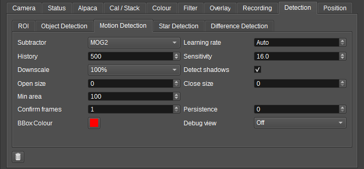

<h4>1. Subtractor</h4>

Selects the background subtractor used for motion detection: MOG2 or KNN.

<h4>2. Learning rate</h4>

Sets the MOG2 learning rate, with Auto for automatic learning.

<h4>3. History</h4>

Sets the background history length.

<h4>4. Sensitivity</h4>

Sets the variance threshold for foreground classification.

<h4>5. Downscale</h4>

Selects an optional reduced-resolution detection path (100%, 50% or 25%).

<h4>6. Detect shadows</h4>

Enables MOG2 shadow detection.

<h4>7. Open size / Close size</h4>

Set the morphological clean-up kernel radii applied to the motion mask. 0 disables.

<h4>8. Min area</h4>

Sets the minimum contour area in square pixels.

<h4>9. Confirm frames</h4>

Sets how many consecutive frames motion must persist before it is reported.

<h4>10. Persistence</h4>

Keeps the last motion boxes visible for this many frames after motion disappears.

<h4>11. BBox Colour</h4>

Selects the motion bounding box colour.

<h4>12. Debug view</h4>

Selects an intermediate motion mask stage (Raw, Thresholded, Opened, Closed or Final) to display instead of the normal image.

On the Cloud Detection sub-tab:

<h4>1. Mode</h4>

Selects the classification path: Auto, Day or Night. Auto picks day or night from the sun elevation at the camera position and the frame's observation time (capture time for played-back media): day only when the sun is up or in early twilight, otherwise night. When no observation time is available, the overall frame brightness decides, with hysteresis so the decision does not flap.

<h4>2. Day threshold</h4>

Sets the minimum red/blue ratio classified as cloud on the day path. Clear blue sky is typically 0.55 to 0.8, cloud 0.9 and above.

<h4>3. Texture threshold</h4>

Day path: sets the fine-scale texture level above which a region cannot be cloud. This rejects grey or white but textured surfaces such as roofs, trees and buildings, which would otherwise pass the red/blue ratio test. The Texture debug view shows the measured texture level. 0 disables the veto. The measured texture depends on the Downscale setting, so retune this if the downscale is changed.

<h4>4. Night threshold</h4>

Sets the threshold on sky-background deviation from the median sky level on the night path.

<h4>5. Background blur</h4>

Sets the blur radius used to estimate the sky background on the night path, in downscaled pixels.

<h4>6. Downscale</h4>

Selects the reduced-resolution detection path (100%, 50%, 25% or 12.5%). Clouds are low-frequency structure, so heavy downscaling is cheap and safe.

<h4>7. Open size / Close size</h4>

Set the morphological clean-up kernel radii applied to the cloud mask. 0 disables.

<h4>8. Update interval</h4>

Sets how many frames pass between cloud mask recomputations. Intermediate frames reuse the previous mask.

<h4>9. Filter stars</h4>

Drops star detections whose centroid falls inside the cloud mask, before plate solving.

<h4>10. Filter motion</h4>

Suppresses motion boxes that substantially overlap the cloud mask.

<h4>11. Motion overlap</h4>

Sets the fraction of a motion box that must be cloud before it is suppressed.

<h4>12. Show mask / Mask colour</h4>

Tints cloud-classified regions on the image with the selected colour.

<h4>13. Debug view</h4>

Selects an intermediate cloud detection stage (Background, Signal, Thresholded, Final or Texture) to display instead of the normal image.

<h4>14. Coverage</h4>

Shows the percentage of the evaluated sky classified as cloud in the latest analysed frame, and whether the day or night path classified it. Regions inside motion exclusion rectangles and borders added by output scaling are not evaluated.

A chart below the settings plots the coverage percentage over time, sampled every few seconds against the frame's capture time (so it also works for video and image playback). Up to 24 hours of history is kept; the bin button clears the chart.

<h4>15. Event threshold</h4>

Sets the coverage percentage at which a Camera Cloud Coverage High event is emitted to the Scheduler. The matching Low event is emitted when coverage falls 10 points below this. An event describing the initial sky state is emitted when capture starts.

<h4>16. Edge margin</h4>

Excludes a margin, given as a percentage of the frame, inward from the edge of the illuminated sky region. On fisheye all-sky lenses the image circle is ringed by a vignetted rim, lens flare and foreground obstructions that are neither clear sky nor cloud; this removes that band from both classification and the coverage percentage. 0 disables it.

<h4>17. Mask sun/moon</h4>

Excludes the projected position of the sun (by day) and moon (by night), so their bright disc and surrounding glare are not classified as cloud. The position is computed from the camera latitude/longitude, the frame's capture time (live wall clock, the time parsed from a video/image file name, or the plate-solver date/time override) and the lens model, so those must be set correctly for the mask to line up. Rather than a fixed disc, the removal sizes itself to the actual bloom: when a near-saturated glare sits at the projected position, the cloud-classified region connected to it - and any classified fragments wholly inside the Sun/moon max radius disc - are removed from the cloud mask, so the exclusion tracks how much the sun/moon blooms at the current gain and exposure. A sun or moon hidden behind thick cloud does not saturate, so cloud in front of it still counts as cloud.

<h4>18. Sun/moon max radius</h4>

Sets the maximum angular radius, in degrees, around the sun/moon within which glare is removed. This is a safety cap: the removal normally sizes itself to what the classifier flagged, and a genuine cloud sheet reaching in from outside this disc is only trimmed where it overlaps the disc, never removed wholesale.

<h4>19. Star sense</h4>

At night, checks whether bright catalog stars are visible at their predicted positions and unmarks detected cloud that stars shine through: a region with most of its expected stars visible is clear sky (or haze too thin to matter), whatever it looks like. A genuinely overcast region blocks its stars, so it is left flagged, and in bright twilight - when no stars are detectable anywhere - the check abstains entirely. Star positions are computed from the camera latitude/longitude, the frame's capture time and the lens model (the same inputs the plate solver uses), so those must be calibrated for the predictions to land on the real stars; stars near the horizon, the sun, the moon or inside exclusion rectangles are not used. The star catalog is the plate solver's (the downloaded catalog when installed, or the bundled bright-star list).

<h4>20. Star sense mag</h4>

Sets the faintest catalog star magnitude checked by star-visibility sensing. Larger values check more, fainter stars; how faint is usable depends on the camera's sensitivity and exposure.

<h4>21. Clear-sky ref</h4>

Compares each frame against a saved per-camera clear-sky reference. Because the clear sky's appearance changes continuously from day through twilight to dark, and with moonlight, references are stored in seven slots keyed by the sky state (sun-elevation band and whether the moon is up); the current frame is compared against the matching slot after both are normalised by their own brightness and colour anchors, absorbing gain and exposure changes. Regions matching the reference within tight tolerances are never classified as cloud - permanently retiring this camera's static quirks (glow pockets, rim artifacts) - while regions standing above the reference in brightness or shifted toward white are classified as cloud even where the built-in heuristics see nothing. A learned foreground mask (trees, roofs, window frames - dark silhouettes at night, finely textured by day) is excluded from evaluation automatically, replacing hand-drawn exclusion rectangles. The comparison abstains when the matching slot is empty or the frame globally disagrees with it (a changed exposure regime). References persist per camera under the application data directory.

<h4>22. Save ref</h4>

Saves the current frame as the clear-sky reference for the current sky state. Press on a cloud-free sky; the slot (Day, Twilight, Deep twilight, Dark, each with or without moon) is chosen automatically from the sun and moon elevation at the frame's capture time, so the camera position and time must be set. The status label shows how many slots are filled - press again at other times of day and night to cover more sky states. The View button opens a viewer showing each slot's stored maps (reconstructed clear-sky brightness, colour ratio, texture and sky mask, plus the derived foreground) so saved and auto-learned references can be checked for sensibleness; Refresh re-reads the store from disk while auto-learning runs.

<h4>23. Auto learn ref</h4>

Automatically blends verified-clear frames into the reference: frames whose measured coverage is very low, additionally confirmed by star-visibility sensing at night when that is enabled, are merged into their slot with a slow blend (throttled to at most one update per ten minutes per slot). This fills slots that were never saved manually and keeps the reference tracking seasons, lens dirt and slow drift.

On the Star Detection sub-tab:

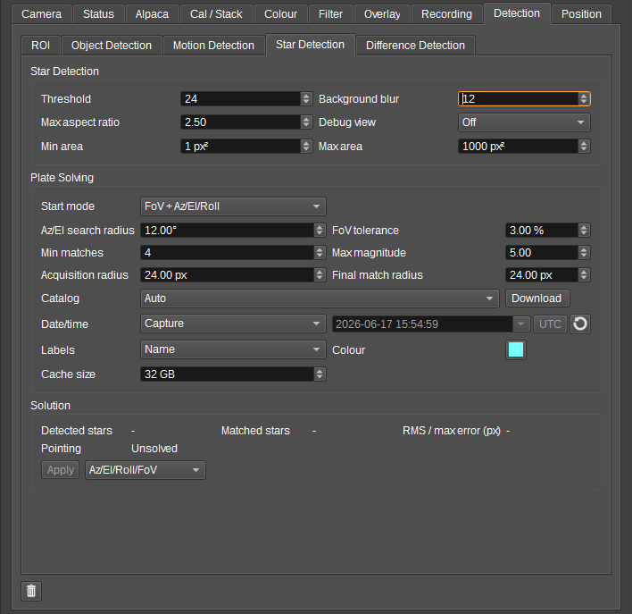

<h4>1. Threshold / Background blur / Min area / Max area / Max aspect ratio</h4>

Set the star candidate extraction parameters.

<h4>2. Debug view</h4>

Displays an intermediate star-detection image (Background, Residual, Thresholded or Final).

<h4>3. Start mode</h4>

Selects the initial information used by the plate solver, from Blind solving through to using current camera settings only.

<h4>4. Az/El search radius</h4>

Sets the azimuth/elevation search radius in degrees.

<h4>5. FoV tolerance</h4>

Sets how well the field of view is known, as a percentage of the FoV. 0 pins to the entered FoV; larger values let the solver refine the FoV, for un-calibrated wide/fisheye lenses.

<h4>6. Min matches</h4>

Sets the minimum number of star matches required for a solution.

<h4>7. Max magnitude</h4>

Sets the faintest catalog star magnitude used for solving.

<h4>8. Acquisition radius / Final match radius</h4>

Set the star match radii in pixels used during acquisition and final matching.

<h4>9. Catalog</h4>

Selects the star catalog used for plate solving (Auto, HYG local/bundled, Siril Gaia DR3 SPCC online or Siril Gaia DR3 Astrometric local). The Download button downloads the selected catalog(s).

<h4>10. Date/time</h4>

Selects whether the solve date/time uses the capture time or a Custom value. When Custom, the date/time editor sets the value, the UTC button treats it as UTC, and the recycle button sets it to now.

<h4>11. Labels</h4>

Selects whether solved stars are labelled by None, Name, Name + magnitude or Name + magnitude + spectral class.

<h4>12. Colour</h4>

Selects the star overlay colour.

<h4>13. Cache size</h4>

Sets the maximum size of the star catalog region disk cache in GB; 0 disables pruning.

<h4>14. Solution</h4>

The Solution group displays the latest plate-solving result: detected stars, matched stars, RMS / max error and pointing. The Apply button applies the last solution to the camera settings, and the adjacent combo selects which solved pointing values (Az/El, Az/El/Roll, Az/El/Roll/FoV or Az/El/Roll/FoV/Lens) are applied.

On the Difference Detection sub-tab:

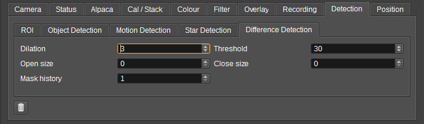

<h4>1. Dilation</h4>

Sets the diff mask dilation kernel size.

<h4>2. Open size</h4>

Sets the morphological open radius before mask accumulation. 0 disables.

<h4>3. Close size</h4>

Sets the morphological close radius after mask accumulation. 0 disables.

<h4>4. Threshold</h4>

Sets the pixel difference threshold for the diff mask.

<h4>5. Mask history</h4>

Sets how many diff masks are retained and combined with a bitwise OR.

If a YOLO model or labels entry is an HTTP or HTTPS URL, the file is downloaded when selected and the local downloaded file is then used.

<h3>Position tab</h3>

The Position tab configures the camera location, pointing, lens model and weather lookup.

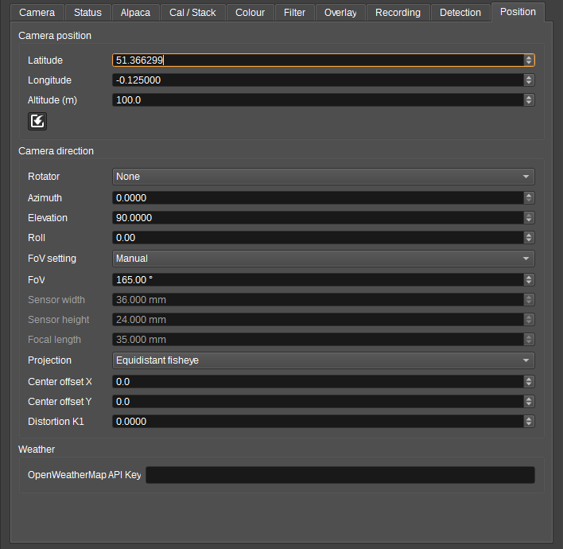

<h4>1. Latitude / Longitude / Altitude</h4>

Set the camera position.

<h4>2. My Position import</h4>

Left click sets the camera position from SDRangel's My Position preferences. Right click toggles continual synchronization from My Position.

<h4>3. Rotator</h4>

Selects a GS232Controller feature used to continually synchronize the camera azimuth and elevation.

<h4>4. Azimuth / Elevation / Roll</h4>

Set the camera pointing direction.

<h4>5. FoV setting</h4>

Selects Manual FoV entry or calculation of the FoV from sensor width, sensor height and focal length.

<h4>6. FoV</h4>

Sets the field of view in degrees, when FoV setting is Manual.

<h4>7. Sensor width / Sensor height / Focal length</h4>

Set the sensor dimensions and focal length in millimetres used to calculate the FoV when FoV setting is Sensor/focal length.

<h4>8. Projection</h4>

Selects the lens projection: Rectilinear, Equidistant fisheye or Equisolid fisheye.

<h4>9. Center offset X / Center offset Y</h4>

Set the lens centre offset in pixels.

<h4>10. Distortion K1</h4>

Sets the first radial lens distortion coefficient.

<h4>11. Playback projection</h4>

For `video:`, `images:` and `stream:` playback, optionally treats a rectangular sub-area of the playback frame as the original optical image. Use this when replaying a recorded video that was scaled into a larger canvas with padding, so star detection, plate solving and sky overlays use the true content rectangle rather than the whole video frame.

<h4>12. OpenWeatherMap API Key</h4>

API key from openweathermap.org used to periodically fetch weather for the camera latitude and longitude.

<h2>YOLO models</h2>

```
from ultralytics import YOLO
model = YOLO("yolov8n.pt")
model.export(format="onnx", opset=12)
```

COCO class list: https://raw.githubusercontent.com/amikelive/coco-labels/refs/heads/master/coco-labels-2014_2017.txt

<h2>Optional Prerequisites</h2>

<h3>ASCOM Platform</h3>

The ASCOM Platform is required for Alpaca telescope and camera support. It can be downloaded from:

https://ascom-standards.org/Downloads/Index.htm

Camera specific ASCOM drivers, such as for ZWO ASI cameras:

https://www.zwoastro.com/layouts/download-desktop-app/

Start ASCOM Remote Server.

ASCOM Alpaca Device API docs are at: https://ascom-standards.org/api/

If imageready is always false, try restarting the ASCOM Remote Server.

If using a Seestar telescope, connect to the telescope using the Seestar app, before trying to control it with SDRangel.

<h2>API</h2>

Full details of the API can be found in the Swagger documentation. Here is a quick example of how to set the camera and capture interval from the command line:

    curl -X PATCH "http://127.0.0.1:8091/sdrangel/featureset/feature/0/settings" -d '{"featureType": "Camera",  "CameraSettings": { "cameraDescription": "c922 Pro Stream Webcam", "captureInterval": 1.0 }}'

To start capturing:

    curl -X POST "http://127.0.0.1:8091/sdrangel/featureset/feature/0/run"

<h2>Dev notes</h2>

To stream an mp4 via http:

    ffmpeg -re -i test.mp4 -c copy -f mpegts -listen 1 "http://127.0.0.1:8080"
    http://127.0.0.1:8080

TCP/MPEG-TS:

    ffmpeg -re -i test.mp4 -c copy -f mpegts -listen 1 tcp://127.0.0.1:8080
    tcp://127.0.0.1:8080

UDP/MPEG-TS:

    ffmpeg -re -i test.mp4 -c copy -f mpegts "udp://127.0.0.1:1234?pkt_size=1316"
    udp://@127.0.0.1:1234?buffer_size=67108864

RTP/MPEG-TS:

    ffmpeg -re -i test.mp4 -c copy -f rtp_mpegts "rtp://127.0.0.1:1234"
    rtp://127.0.0.1:1234?buffer_size=67108864&reorder_queue_size=5000&max_delay=500000

RTSP (struggles with very high bitrate):
    
    in mediamtx.yml set writeQueueSize: 16384
    mediamtx 
    ffmpeg -re -i test.mp4 -c copy -rtsp_transport tcp -f rtsp rtsp://127.0.0.1:8554/live
    rtsp://127.0.0.1:8554/live

RTMP:
    
    mediamtx 
    ffmpeg -re -i test.mp4 -c copy -f flv rtmp://127.0.0.1:1935/live
    rtmp://127.0.0.1:1935/live

<h2>Attribution</h2>

- Coded using AI. Thanks to all the open source code and documentation that made this possible!
- Hipparcos Catalog by ESA (CC BY-NC 3.0 IGO)
- HYG Catalog by astronexus (CC-BY-SA 4.0)
- Object detection by Lars Meiertoberens from Noun Project (CC BY 3.0)
- html by wira wianda from Noun Project (CC BY 3.0)
- clock by Alv Jørgen Bovolden from Noun Project (CC BY 3.0)
- invert by Meko from Noun Project (CC BY 3.0)
- subtract-picture by Smashicons from Noun Project (CC BY 3.0)
- media player icons by Ranah Pixel Studio from Noun Project (CC BY 3.0)
- meteor by Color Combo from Noun Project (CC BY 3.0)
- stack image by I Putu Dicky Adi Pranatha from Noun Project (CC BY 3.0)
- constellation by BomSymbols from Noun Project (CC BY 3.0)
- constellation by verry poernomo from from Noun Project (CC BY 3.0)
- order by kumakamu from Noun Project (CC BY 3.0)
- youtube by Kholila wale from Noun Project (CC BY 3.0)
